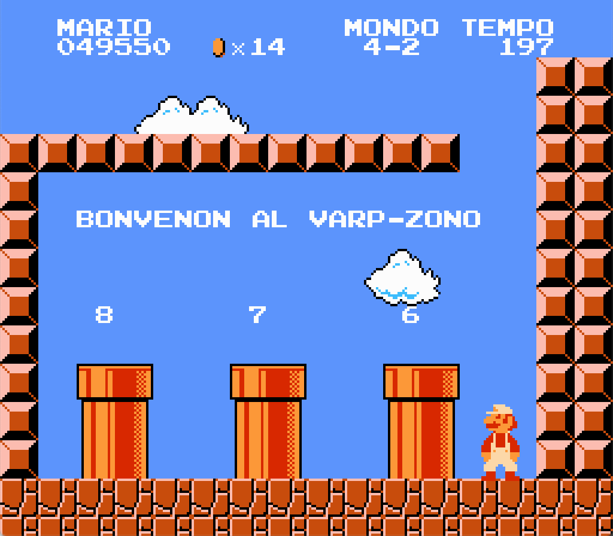

# Super Mario Bros

_Legu
[supermariobros-readme.txt](supermariobros-readme.txt)
por esperanta priskrbo._

This project is a fan translation of
[Super Mario Bros](https://en.wikipedia.org/wiki/Super_Mario_Bros.),
a video game for the Nintendo Entertainment System, to Esperanto. All
copyrights on the original game belong to Nintendo.

You *must* own a physical copy of the Super Mario Bros cartridge. Downloading
the ROM of any game which you do not own may be considered piracy.

  * Super Mario Bros - CRC32 `3337EC46`

## Screenshots

Here are some pretty screenshots:

